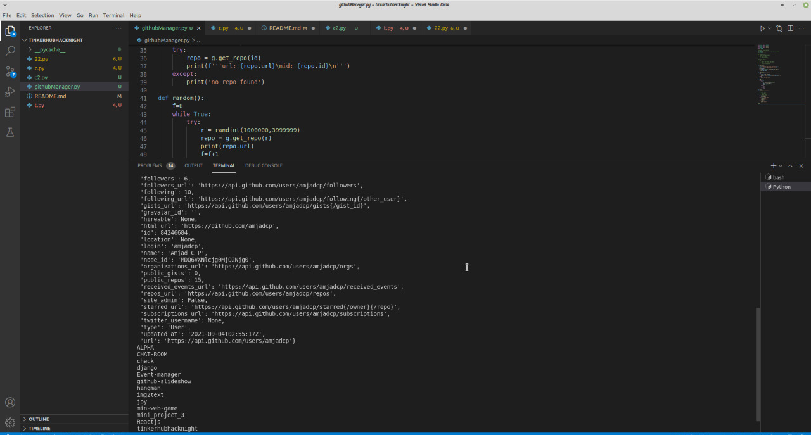
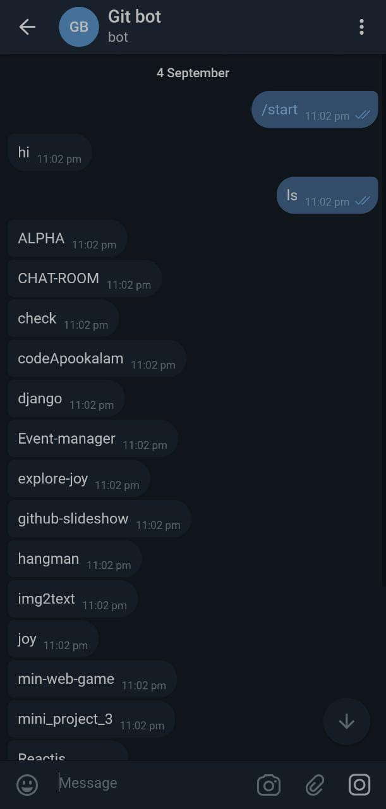

<h1 align="center">GitBot</h1>

  <p align="center">
    Simple github manager for cli and telegram 
    <br />


<!-- ABOUT THE PROJECT -->


## About The Project
### CLI Example
---


<br>
<br>

### Telegram Example
---



<!-- GETTING STARTED -->
## Getting Started

This is an example of how you may give instructions on setting up your project locally.
To get a local copy up and running follow these simple example steps.

### Built With

This section should list any major frameworks that you built your project using. Leave any add-ons/plugins for the acknowledgements section. Here are a few examples.
* [Python](https://www.python.org/)
* [Flask](https://flask.palletsprojects.com/)
* [Replit](https://replit.com/)
* [UptimeRobot](https://uptimerobot.com/)

### Prerequisites

This is an example of how to list things you need to use the software and how to install them.

### Installation

1. Clone the repo
   ```sh
   git clone https://github.com/harshalbabu/tinkerhubhacknight.git
   ```
3. Install required packages
   ```sh
   pip install -r requirements.txt
   ```


<!-- USAGE EXAMPLES -->
## Usage

 Run gitBot.py
   ```sh
   python gitBot.py
   ```

### Using the telegram bot

1. <a href="https://t.me/GITtheTelegramBot">Click here</a> to use 'GittheTelegramBot'
2. or search 'GittheTelegramBot'
3. Example messages 
   - username:<github username>
   - password:<personal access token>
   - mkdir <Name for repository>
   - ls

## Contributers
* [Amjad CP](https://github.com/amjadcp)
* [Harshal Babu T K N](https://github.com/harshalbabu)
